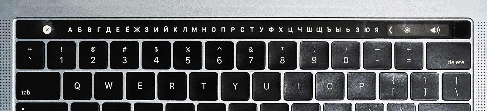

# Russian Touch Bar
🇷🇺 Type in Russian with the Touch Bar on Macbook Pro

## Download
- [Click here to download Russian Touch Bar](https://github.com/262hz/RussianTouchBar/releases/download/1.0/Russian.Touch.Bar.app.zip)

## How to Use
Use the Russian Touch Bar in any app by tapping the `РУ` button in the Touch Bar. When you first launch the app, you will need to allow access in System Preferences > Security & Privacy. The app runs in the background and has no visible icon on the dock. To quit the app, open Activity Monitor, search for "Russian Touch Bar" and click the "X" button to quit.

This app uses a private API... #sorryNotSorry